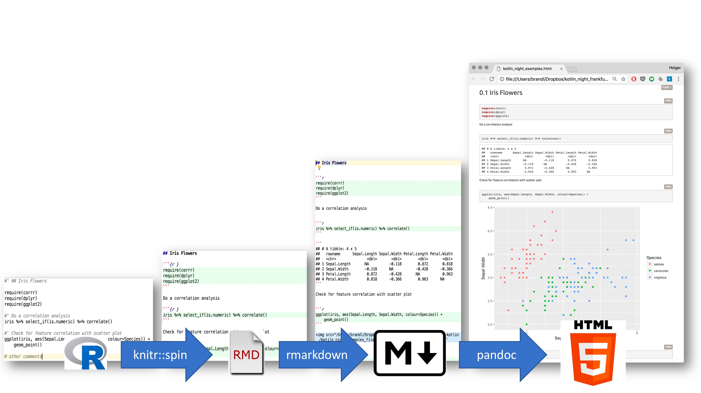
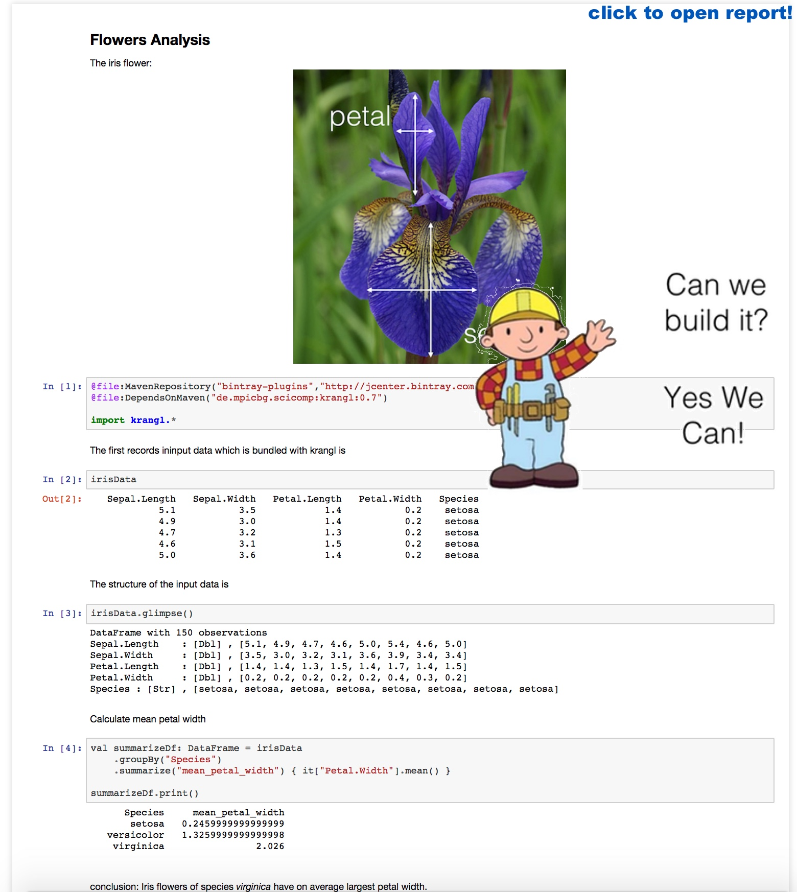

Data science workflows written with Kotlin can be rendered to html, pdf, and markdown using Jupyter. To do so we need a kernel.

> A kernel provides programming language support in Jupyter. IPython is the default kernel. Additional kernels include R, Julia, and many more.

Two competing kernels are available for Kotlin

1. https://github.com/ligee/kotlin-jupyter

    * More established
    * Backed by JB
    * Friendly and responsive developers
    * Not really active

2. https://github.com/twosigma/beakerx

    > a collection of JVM kernels and interactive widgets for plotting, tables, auto-translation, and other extensions to Jupyter Notebook.

    * Very active, fast progress
    * Friendly and very responsive developers
    * Not __just__ a kernel
    * Display handler registry in kernel `krangl.beakerx.TableDisplayer.register()`


In our opinion, Kotlin-powered Jupyter notebooks are definitely cool, but lacks efficiency because of missing tooling (error checking, completion, refactoring):

# Build reports embedding code and results


However, the kernel can be used for literate programming, which enables result consistency and streamline communication by building reports from code

So finally we want to develop data workflows interactively using plain and simple code. Similar to how it is possible with R via the well known tool chain built around `knitr`->`pandoc`:



Similary, in python this can be achieved by startin with markdown -> `notedown` + `nbconvert`

**Can we do this with Kotlin?**

Let's consider the following example


```kotlin
//' ## Flowers Analysis

//' The iris flower
//' 

@file:MavenRepository("bintray-plugins","http://jcenter.bintray.com")
@file:DependsOnMaven("de.mpicbg.scicomp:krangl:0.7")

import krangl.*


//' The first records in the input data (which is bundled with krangl) are
irisData

//' The structure of the input data is
irisData.glimpse()

//' Calculate mean petal
val summarizeDf: DataFrame = irisData
    .groupBy("Species")
    .summarize("mean_petal_width") { it["Petal.Width"].mean() }

//' Print the summarized data
summarizeDf.print()

//' Conclusion: Iris flowers of species _virginica_ have on average the largest petal width.
```

An `kts->html` conversion could be impelmented as follows:

```bash
inputScript=krangl_example_report.kts
reportName=$(basename $inputScript .kts)

# https://www.r-project.org/
Rscript - ${inputScript} <<"EOF"
knitr::spin(commandArgs(T)[1], doc = "^//'[ ]?", knit=F)
EOF

# https://github.com/holgerbrandl/kscript
kscript -t 'lines.map { it.replace("{r }", "")}.print()' ${reportName}.Rmd > ${reportName}.md

# https://github.com/aaren/notedown
notedown ${reportName}.md > ${reportName}.ipynb

# http://jupyter.org/install
jupyter nbconvert --ExecutePreprocessor.kernel_name=kotlin \
        --execute --to html ${reportName}.ipynb --output ${reportName}
```

Proof-of-Concept. :-)

<a href="./krangl_example_report.html" rel="some text"></a>

